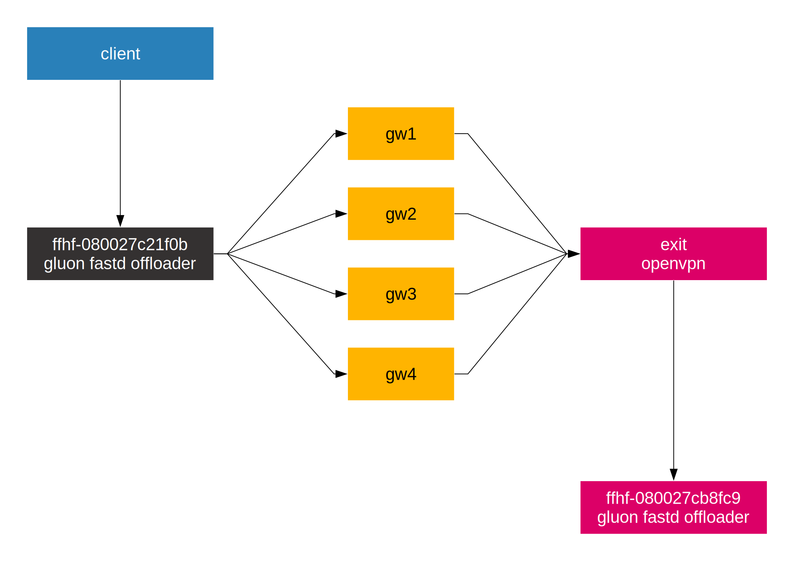

Testumgebung
============

   Netzwerkdiagramm Testumgebung

Beispielausgabe von ``batctl o`` auf einem gluon Node.

.. code:: bash

    [B.A.T.M.A.N. adv 2016.2, MainIF/MAC: mesh-vpn/72:85:7b:32:ea:38 (bat0 BATMAN_IV)]
      Originator      last-seen (#/255)           Nexthop [outgoingIF]:   Potential nexthops ...
    02:42:0a:22:00:03    7.150s   (250) 02:42:0a:22:00:03 [  mesh-vpn]: 02:42:0a:22:00:01 (213) 02:42:0a:22:00:03 (250)
    02:42:0a:22:00:01    8.590s   (250) 02:42:0a:22:00:01 [  mesh-vpn]: 02:42:0a:22:00:03 (216) 02:42:0a:22:00:01 (250)
    02:42:0a:22:00:04    2.120s   (150) 02:42:0a:22:00:03 [  mesh-vpn]: 02:42:0a:22:00:01 (147) 02:42:0a:22:00:03 (150)
    02:42:0a:22:00:02    2.120s   (183) 02:42:0a:22:00:03 [  mesh-vpn]: 02:42:0a:22:00:03 (183) 02:42:0a:22:00:01 (181)
